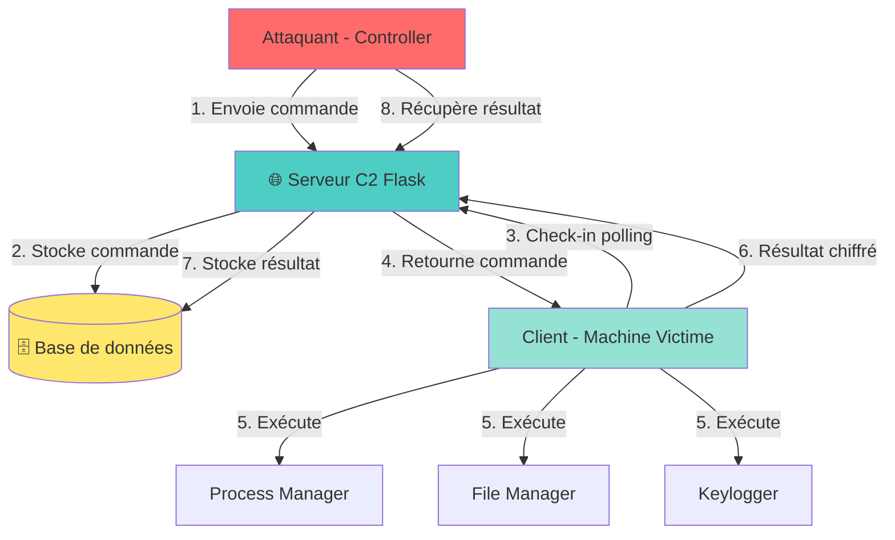
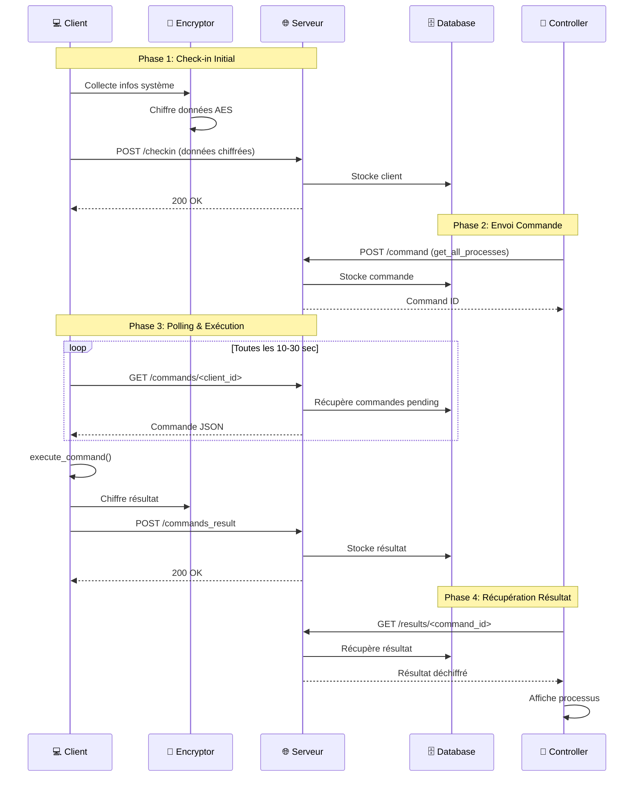
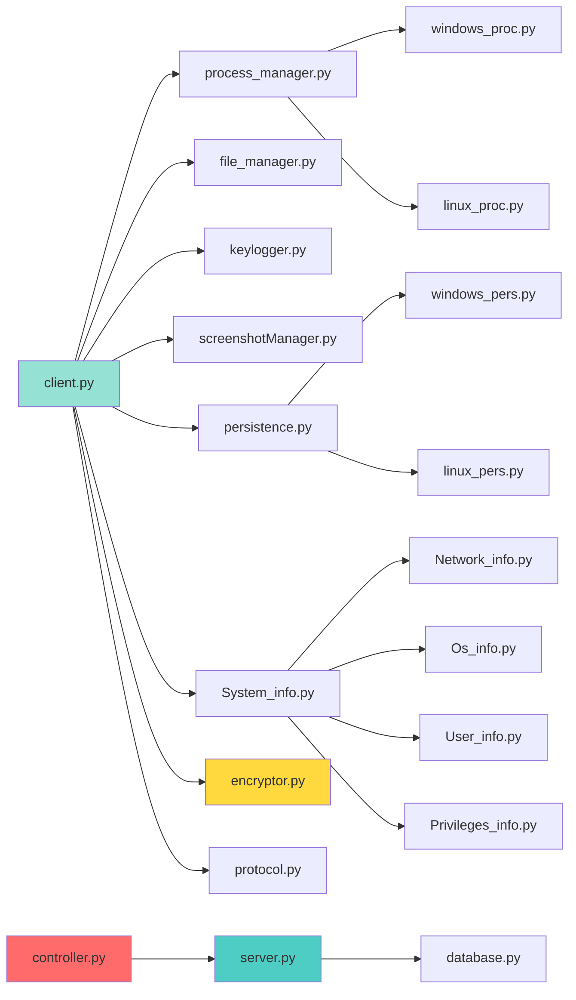
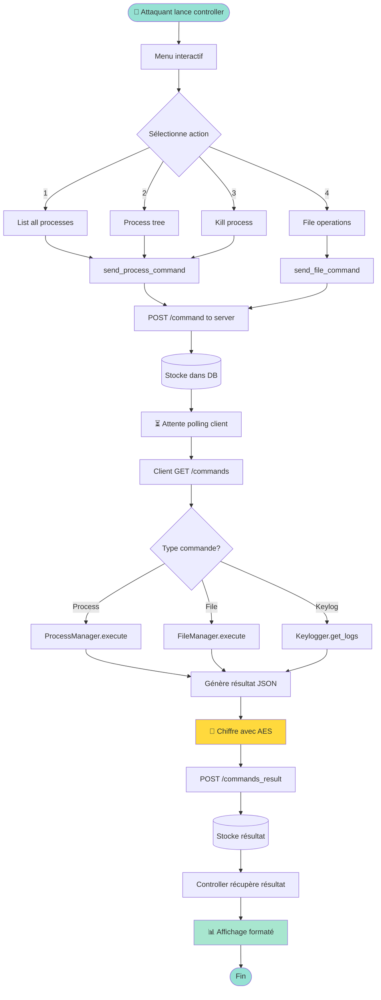

# 🔧 Fonctionnalités du RAT

## 📋 Architecture Générale

**Client-Serveur (C2)** : Le client s'exécute sur la machine cible et communique avec le serveur de commande via HTTPS.



---

## 🎯 Fonctionnalités Principales

### 1. **Gestion des Processus** (`windows_proc.py` / `linux_proc.py`)

| Fonction | Description |
|----------|-------------|
| `get_all_processes()` | Liste tous les processus avec PID, nom, utilisateur, CPU%, mémoire |
| `get_process_tree()` | Affiche l'arbre hiérarchique des processus (parent → enfants) |
| `get_process_details()` | Détails complets d'un processus (connexions réseau, threads, fichiers ouverts) |
| `kill_process()` | Terminer un processus par PID |
| `suspend_process()` | Mettre en pause un processus |
| `resume_process()` | Relancer un processus suspendu |

### 2. **Gestion des Fichiers** (`file_manager.py`)

| Fonction | Description |
|----------|-------------|
| `list_directory()` | Lister fichiers/dossiers d'un répertoire |
| `read_file()` | Lire le contenu d'un fichier texte |
| `write_file()` | Créer/modifier un fichier |
| `delete_file()` | Supprimer un fichier |
| `download_file()` | Télécharger un fichier de la machine cible vers le serveur |
| `upload_file()` | Envoyer un fichier du serveur vers la machine cible |
| `search_files()` | Rechercher des fichiers par nom/extension |

### 3. **Persistance** (`persistence.py`, `windows_pers.py`, `linux_pers.py`)

| Fonction | Description |
|----------|-------------|
| `install_persistence()` | **Windows** : Clé de registre `Run` + copie dans AppData<br>**Linux** : Service systemd ou cron job |
| `check_persistence()` | Vérifier si la persistance est active |
| `remove_persistence()` | Désinstaller la persistance |

**Emplacements Windows** :
- `HKEY_CURRENT_USER\Software\Microsoft\Windows\CurrentVersion\Run`
- `%APPDATA%\Microsoft\Windows\Update.exe`

### 4. **Keylogger** (`keylogger.py`)

| Fonction | Description |
|----------|-------------|
| `start()` | Démarrer l'enregistrement des touches clavier |
| `stop()` | Arrêter le keylogger |
| `get_logs()` | Récupérer tout ce qui a été tapé |

**Bibliothèques** : `pynput` (multi-plateforme)

### 5. **Screenshots** (`screenshotManager.py`)

| Fonction | Description |
|----------|-------------|
| `capture_screenshot()` | Prendre une capture d'écran |
| `get_screenshot_base64()` | Retourner l'image encodée en base64 pour transfert |

### 6. **Informations Système** 

**Modules** : `System_info.py`, `Network_info.py`, `Os_info.py`, `User_info.py`, `Privileges_info.py`

| Module | Informations collectées |
|--------|-------------------------|
| **System_info** | Hostname, OS, version, architecture (32/64 bits), RAM, CPU |
| **Network_info** | IP publique/locale, interfaces réseau, connexions actives, passerelle |
| **Os_info** | Nom OS, version, build, uptime |
| **User_info** | Utilisateur actuel, groupes, permissions, répertoire home |
| **Privileges_info** | Droits admin, UAC, méthodes d'élévation de privilèges possibles |

### 7. **Chiffrement** (`encryptor.py`)

| Fonction | Description |
|----------|-------------|
| `encrypt()` | Chiffre les données avec AES-128 CBC |
| `decrypt()` | Déchiffre les données |

**Clé** : `vErY_SeCrEt_KeY.57976461314853` (hardcodée dans `config.py`)

### 8. **Communication** (`protocol.py`)

| Fonction | Description |
|----------|-------------|
| `create_checkin_message()` | Message de connexion initial du client |
| `create_command_result_message()` | Réponse après exécution d'une commande |
| `parse_command()` | Analyser une commande reçue du serveur |

**Format** : Messages JSON chiffrés envoyés via POST HTTPS

---

## 🖥️ Composants

### **Client** (`client.py`)

- **Connexion** : Se connecte au serveur toutes les 10-30 secondes (polling)
- **Commandes** : Exécute les commandes reçues du serveur
- **Réponses** : Envoie les résultats au serveur

**URL Serveur** : `https://server-70ts.onrender.com`

### **Serveur** (`server.py`)

- **API Flask** : Endpoints pour recevoir check-ins et envoyer commandes
- **Base de données** : Supabase PostgreSQL (optionnel)
- **Endpoints** :
  - `POST /checkin` - Client se connecte
  - `GET /commands/<client_id>` - Client récupère commandes
  - `POST /commands_result` - Client envoie résultats

### **Controller** (`controller.py`)

Interface en ligne de commande pour :
- Voir les clients connectés
- Envoyer des commandes aux clients
- Gérer processus et fichiers à distance
- Télécharger screenshots

---

## 🔐 Sécurité

| Fonctionnalité | Description |
|----------------|-------------|
| **Chiffrement AES** | Toutes les communications sont chiffrées |
| **HTTPS** | Communication sécurisée avec le serveur |
| **Stealth** | Exe compilé avec `--noconsole` (pas de fenêtre) |
| **CREATE_NO_WINDOW** | Subprocess ne créent pas de fenêtres visibles |

---

## 📦 Compilation

**PyInstaller** : Transforme le client Python en `.exe` standalone

```bash
python compile.py          # Version stealth (--noconsole)
```

**Output** : `dist/WindowsUpdate.exe` (~30 MB)

---

## 🚀 Workflow d'utilisation

1. **Démarrer serveur** : `python server.py`
2. **Compiler client** : `python compile.py`
3. **Déployer exe** sur machine cible
4. **Lancer controller** : `python controller.py`
5. **Sélectionner client** et envoyer commandes

---

## ⚠️ Limitations

- Antivirus peuvent détecter le keylogger/RAT
- Nécessite Python 3.12+ pour compilation
- Serveur doit être accessible en HTTPS
- Client nécessite connexion Internet

---

## 📚 Fonctions Détaillées par Module

### **client.py**

```python
__init__()                    # Initialise client avec ID unique, chiffrement, managers
connect_to_server()           # Établit connexion au serveur C2
send_checkin()                # Envoie message de connexion avec infos système
fetch_commands()              # Récupère commandes en attente du serveur
execute_command()             # Exécute une commande reçue
send_command_result()         # Envoie résultat d'exécution au serveur
handle_process_command()      # Traite commandes liées aux processus
handle_file_command()         # Traite commandes liées aux fichiers
run()                         # Boucle principale du client (polling)
```

### **controller.py**

```python
get_clients()                 # Liste tous les clients connectés
get_client_info()             # Détails d'un client spécifique
send_command()                # Envoie commande à un client
send_process_command()        # Envoie commande de gestion processus
send_file_command()           # Envoie commande de gestion fichiers
handle_list_processes()       # Affiche liste des processus
handle_process_tree()         # Affiche arbre hiérarchique
handle_kill_process()         # Interface pour terminer processus
interactive_mode()            # Menu interactif principal
```

### **server.py** (Flask API)

```python
@app.route('/checkin')        # POST - Enregistre connexion client
@app.route('/commands/<id>')  # GET - Client récupère ses commandes
@app.route('/commands_result')# POST - Client envoie résultats
@app.route('/clients')        # GET - Liste tous les clients
store_command()               # Stocke commande dans DB
get_pending_commands()        # Récupère commandes non exécutées
update_client()               # Met à jour statut client
```

### **encryptor.py**

```python
Encryptor.__init__(key)       # Initialise chiffreur avec clé AES
pad()                         # Ajoute padding PKCS7 aux données
unpad()                       # Retire padding après déchiffrement
encrypt(data)                 # Chiffre données en base64
decrypt(encrypted_data)       # Déchiffre données base64
```

### **protocol.py**

```python
create_checkin_message()      # Crée message JSON de check-in
create_command_result_message() # Crée message de résultat
parse_command()               # Parse commande JSON reçue
validate_command()            # Vérifie format de commande
```

### **keylogger.py**

```python
Keylogger.__init__()          # Initialise buffer et listener
on_press(key)                 # Callback touche pressée
on_release(key)               # Callback touche relâchée
start()                       # Démarre capture clavier
stop()                        # Arrête capture
get_logs()                    # Retourne texte capturé
clear_logs()                  # Vide buffer
```

### **screenshotManager.py**

```python
capture_screenshot()          # Capture écran avec PIL/Pillow
save_screenshot(path)         # Sauvegarde en fichier
get_screenshot_base64()       # Encode screenshot en base64
capture_window(title)         # Capture fenêtre spécifique
```

### **process_manager.py**

```python
__init__()                    # Détecte OS et charge bon manager
get_all_processes()           # Délègue vers Windows/Linux
get_process_tree()            # Délègue arbre processus
get_process_details(pid)      # Détails complet d'un processus
kill_process(pid)             # Tue processus
suspend_process(pid)          # Suspend processus
resume_process(pid)           # Reprend processus
```

### **file_manager.py**

```python
list_directory(path)          # Liste contenu dossier
read_file(path)               # Lit fichier texte
write_file(path, content)     # Écrit dans fichier
delete_file(path)             # Supprime fichier
delete_directory(path)        # Supprime dossier
download_file(remote, local)  # Télécharge fichier
upload_file(local, remote)    # Upload fichier
search_files(path, pattern)   # Recherche fichiers
get_file_info(path)           # Stats fichier (taille, dates)
```

### **database.py**

```python
init_database()               # Crée tables PostgreSQL
get_client()                  # Récupère client par ID
update_client()               # Met à jour infos client
store_command()               # Stocke commande pour client
get_pending_commands()        # Commandes non exécutées
mark_command_executed()       # Marque commande comme faite
get_command_results()         # Résultats d'exécution
```

### **windows_proc.py** (Spécifique Windows)

```python
get_all_processes(detailed)   # Liste processus avec CPU/RAM
get_process_tree()            # Arbre hiérarchique
get_process_details(pid)      # Détails + connexions réseau
kill_process(pid)             # Termine processus
suspend_process(pid)          # Suspend (Win32 API)
resume_process(pid)           # Reprend (Win32 API)
_get_windows_session_id()     # Session RDP/Console
_get_process_services()       # Services associés au processus
_get_process_privileges()     # Privilèges du processus
```

### **linux_proc.py** (Spécifique Linux)

```python
get_all_processes(detailed)   # Liste avec namespaces, cgroups
get_process_tree()            # Arbre avec utilisateurs
get_process_details(pid)      # Détails + capabilities Linux
kill_process(pid)             # kill -9
suspend_process(pid)          # SIGSTOP
resume_process(pid)           # SIGCONT
_get_process_capabilities()   # Capabilities Linux
_get_process_limits()         # ulimits
```

### **persistence.py**

```python
PersistenceManager.__init__() # Détecte OS
_init_persistence()           # Charge Windows/Linux manager
install_persistence()         # Installe selon OS
check_persistence()           # Vérifie si actif
remove_persistence()          # Désinstalle
```

### **windows_pers.py**

```python
install_persistence()         # Registry Run + copie AppData
copy_to_sys_location()        # Copie exe dans dossier caché
_add_registry_entry()         # Ajoute clé Run
remove_persistence()          # Supprime clé + exe
check_persistence()           # Vérifie clé existe
```

### **linux_pers.py**

```python
install_persistence(user)     # systemd user/system service
_create_service_file()        # Génère fichier .service
_install_system_service()     # Service root (systemctl)
_install_user_service()       # Service utilisateur
remove_persistence()          # systemctl disable + rm
check_persistence()           # systemctl is-enabled
```

### **System_info.py**

```python
get_system_info()             # Collecte infos complètes
get_basic_info()              # Hostname, OS, version
get_hardware_info()           # CPU, RAM, disques
get_network_summary()         # IPs, interfaces
```

### **Network_info.py**

```python
get_network_info()            # Infos réseau complètes
get_public_ip()               # IP publique via API
get_local_ips()               # IPs locales (LAN)
get_interfaces()              # Cartes réseau actives
get_connections()             # Connexions TCP/UDP
get_default_gateway()         # Passerelle par défaut
```

### **Privileges_info.py**

```python
get_privileges_info()         # Détecte privilèges
get_windows_token_privileges()# Privilèges Windows (whoami /priv)
find_windows_escalation()     # Méthodes d'élévation (UAC bypass)
has_vulnerable_services()     # Services exploitables
has_writable_scheduled_tasks() # Tâches planifiées modifiables
check_always_install_elevated() # Registry AlwaysInstallElevated
```

### **compile.py / compile_debug.py**

```python
compile_client()              # PyInstaller avec options
add_icon()                    # Ajoute icône Windows
set_version_info()            # Métadonnées exe
clean_build()                 # Nettoie fichiers temporaires
```

---

## 🔄 Flux de Données



---

## 📊 Structure des Modules



---

## 🔀 Workflow d'une Commande



